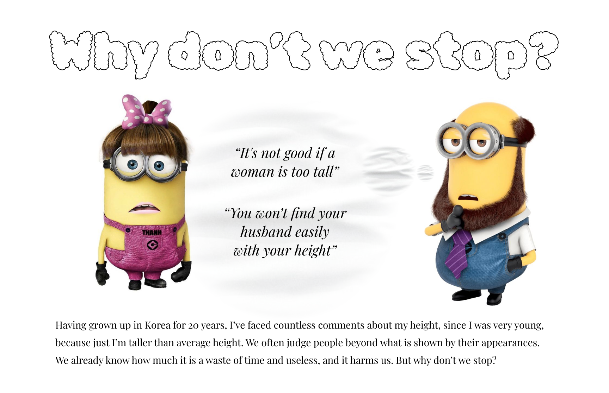
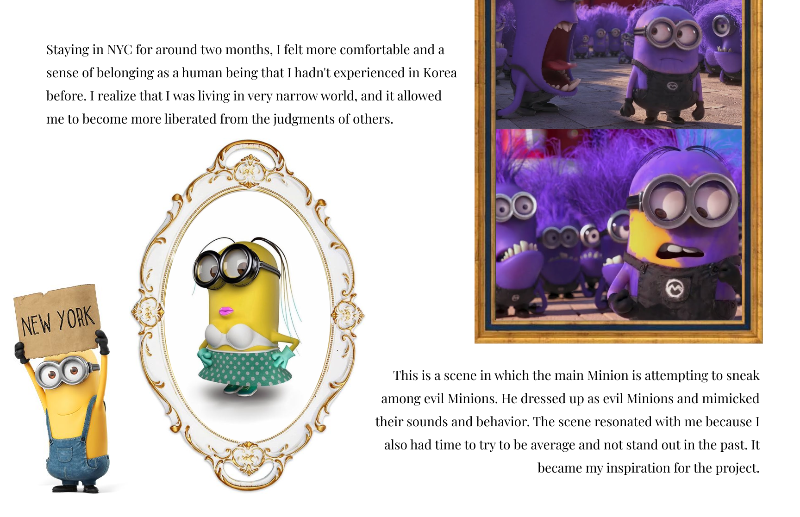
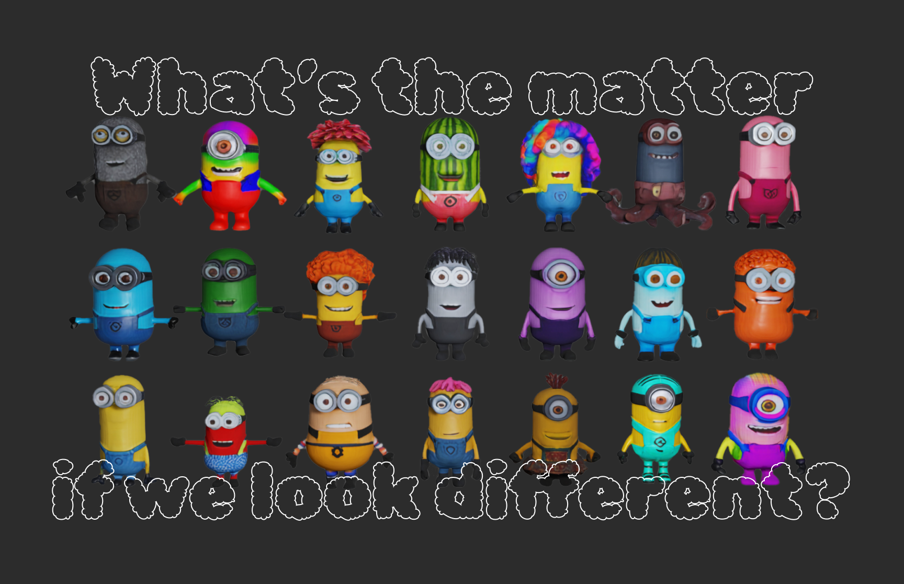

# Minionize 👑

**Minionize** is a mirror room(inspired by [Noh Theatre](https://www.the-noh.com/en/world/stage.html) 's mirror room)space where uses Minions as a metaphor to draw myself (==Minions) and become that Minion (==me).

### DEMO IS HERE!! 🎭

 

[Visit our demo](https://minionize.vercel.app/) and feel free to put feedback as github issues. (Web camera and speaker are required)

##  

### Minionize

This project provides some time to focus more on ourselves to be the Minion that we define. No restriction or limitation to being my Minion and there is no specific definition of Minion either.

I want to convey the message “What’s the matter” through my childhood experience back in South Korea. (Refer to the images below!)

 
 
 
 

> All 3d models used in the project were generated by text-to-3d model Genie, Luma AI.

---

### Implementation

This project is built on React with Typescript. It utilizes Three.js to show 3d models on the main page and MindAR API to implement an AR face filter.
